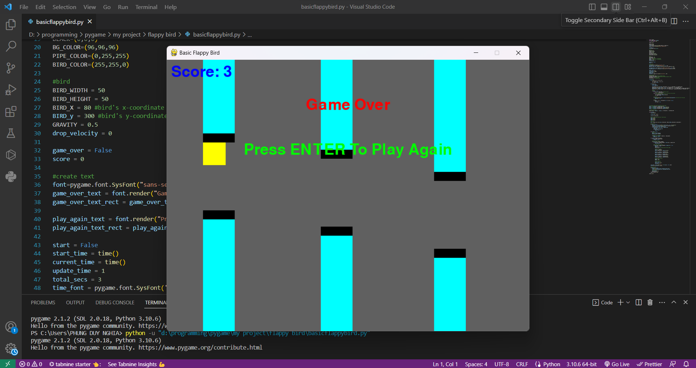

# [PYTHON] BASIC FLAPPY BIRD

## Introduction
* Have you heard of a game called Flappy Bird ? It's a game with a simple yet challenging gameplay. When I was young, I used to play it on my parents' phone, so I wanted to try playing it again by writing my own code.

* I named it **Basic Flappy Bird** because it's the game I wrote with just squares, rectangles, no sound, and everything is very simple.

<<<<<<< HEAD
<image src="assets/basicflappybird.gif">
=======

    <video src="assets/basicflappybird.mp4" controls >

>>>>>>> 3d06709bd8fc918e4269b3227aa22dc3355b162c

## How to play
    The gameplay is quite simple.
* First, when you run the file, the timer will start counting down from 3 seconds. After which, you need to press the arrow keys flexbily for the bird to fly and pass through the pipes.
* When you lose, the screen will display "Press ENTER To Play Again", then you press the Enter key to retry the game.

## How to use the code
* Please make sure you have python installed.If not you can go to the homepage to download:https://www.python.org/ and you need to install pygame and the simplest way is to use the pip tool
* Find and download files basicflappybird.py
* Run that python file
* Finally play the game
